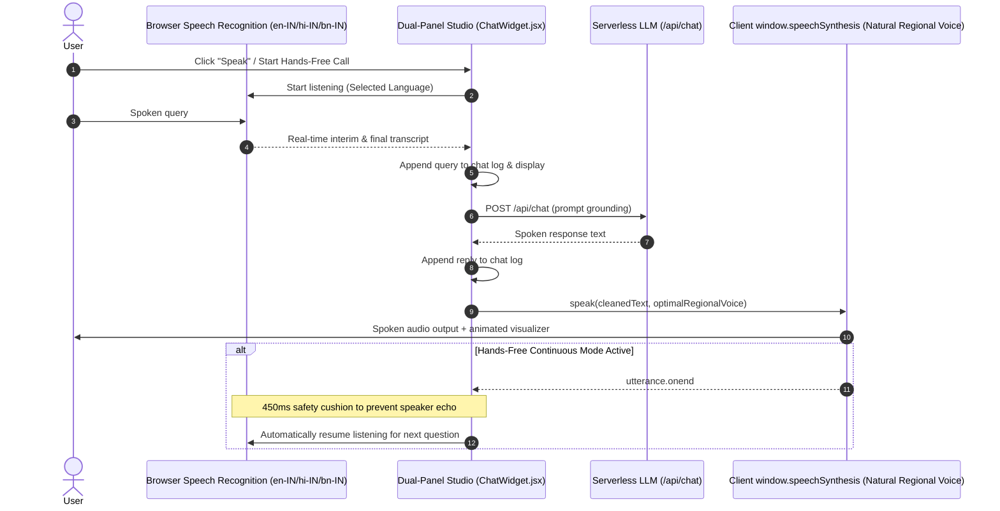

# SAURIK IT Website Architecture & Technical Design Principles

**Version:** 1.5  
**Last Updated:** 23 September 2026  
**Status:** Living Technical Architecture Document  

---

## 1. Executive Architectural Overview

The **SAURIK IT Private Limited** digital presence (`saurik-it-website`) combines a high-performance Single Page Application (SPA) for corporate service discovery with a dedicated, zero-JS static HTML/CSS landing page architecture for its flagship B2B field workforce & van-stock platform, **Saurik Track** (`/track`). A floating AI website assistant provides answers grounded in published content through a separate serverless API boundary.

The system is constructed with a strict philosophy: **"Technology, Deliberately."** Every architectural decision prioritizes clarity of information, verifiable claims, lightning-fast Core Web Vitals, accessible interaction patterns (WCAG 2.2 AA), and complete separation between content datasets and presentation components.

```mermaid
graph TD
    User([Visitor / Crawler / Bot]) --> Gateway{Vercel Edge / CDN}
    
    Gateway -->|GET /track or /track/| StaticTrack[dist/track/index.html - Zero-JS Static SSR HTML]
    Gateway -->|GET / og-image.png / robots.txt / sitemap.xml| StaticAssets[dist/ Public Static Assets]
    Gateway -->|GET /api/*| ServerlessAPI[api/chat.js - Vercel Serverless Endpoint]
    Gateway -->|All other routes| SpaIndex[dist/index.html - React 18 SPA Entry]
    
    subgraph SPA Layer [React 18 / Vite 6 / React Router v6]
        SpaIndex --> MainJSX[src/main.jsx]
        MainJSX --> AppShell[src/App.jsx Layout Shell]
        
        AppShell --> Header[src/components/Header.jsx]
        AppShell --> RouterView[React Router Routes]
        AppShell --> WhatsApp[src/components/WhatsAppCTA.jsx]
        AppShell --> ChatWidget[src/components/ChatWidget.jsx]
        AppShell --> Footer[src/components/Footer.jsx]
        
        RouterView --> Home[/ Home]
        RouterView --> Software[/software Software & IT]
        RouterView --> Hardware[/hardware Hardware & IT]
        RouterView --> About[/about About & Story]
        RouterView --> Contact[/contact Smart Enquiry]
        RouterView --> TrackClient[/track React Route Component]
        RouterView --> ArthosClient[/arthos React Route Component]
        RouterView --> Privacy[/privacy Data Policy]
        RouterView --> NotFound[* 404 Fallback]
    end
    
    subgraph Data & Content Layer [src/data/]
        CompanyData[(companyData.js)]
        SoftwareData[(softwareData.js)]
        HardwareData[(hardwareData.js)]
        TrackData[(trackData.js)]
    end
    
    Home -.-> CompanyData
    Software -.-> SoftwareData
    Hardware -.-> HardwareData
    Contact -.-> CompanyData
    Footer -.-> CompanyData
    ChatWidget --> ChatAPI[api/chat.js - POST /api/chat]
    ChatAPI --> ChatContext[src/data/chatContext.js]
    ChatAPI --> Providers[api/_lib/llmProviders.js]
```

---

## 2. Technology Stack & Decision Rationale

| Layer | Technology | Decision Rationale |
| :--- | :--- | :--- |
| **Saurik Track Landing Page** | Pure Static HTML5 + CSS3 (`public/track/`) | Zero-JS default, build-time SSG/SSR crawlability. Guaranteed instant indexability for Googlebot, social media card scrapers, and AI answer engines. |
| **Corporate App Framework** | React 18 (`react`, `react-dom`) | Component modularity, functional hooks, declarative UI rendering for interactive corporate pages. |
| **Build & Dev Tooling** | Vite 6 | Sub-second Hot Module Replacement (HMR), tree-shaking, Rollup bundling, and automated copying of `public/` assets to `dist/`. |
| **Routing** | React Router v6 (`react-router-dom`) + Vercel Edge Rewrites | Declarative client-side routing in the SPA; Vercel edge rewrite priority for `/track` ensures direct zero-JS HTML delivery. |
| **Styling & Design Tokens** | Tailwind CSS 3 + PostCSS + Scoped CSS Custom Properties | Corporate site uses Tailwind tokens (`canvas`, `surface`, `ink`, `accent`). Saurik Track uses dedicated `:root` CSS custom properties (`--paper`, `--navy`, `--amber`, `--moss`, `--line`). |
| **Iconography** | Lucide React (`lucide-react`) + SVG | Consistent, accessible SVG stroke icon family. Emojis are strictly banned as interface icons. |
| **Asset Generation** | Node.js + Headless Chrome / `pngjs` | Programmatically generates 1200×630 `og-image.png`, 180×180 `apple-touch-icon.png`, and `favicon.ico` directly during build. |
| **AI Assistant API** | Vercel serverless function + provider SDKs | Keeps LLM credentials server-side, limits request history, and supports provider selection without bundling secrets into the browser. |

---

## 3. Core Architectural Principles

### 3.1. "Technology, Deliberately" Philosophy
- Avoid technology bloat. We do not load heavy 3D canvas libraries, unverified third-party analytics trackers, or intrusive popups.
- Avoid artificial claims: No unverified client counts, fake testimonial avatars, or partner logos without legal agreement.
- Transparent deliverables: Every service card clearly outlines problem solved, deliverables, information needs, and timelines.

### 3.2. Single Source of Truth for Content (The Data Layer)
All business copy, contact details, capability lists, hardware specifications, and FAQ answers reside in `src/data/`:
- `src/data/companyData.js`: Legal entity name, verified phone, verified email, working principles, 4-stage delivery process.
- `src/data/softwareData.js`: 5 confirmed software capabilities in the owner-approved priority order, Agentic AI workflow stages, software FAQs.
- `src/data/hardwareData.js`: 3 confirmed hardware categories (CCTV, Computers, Servers), Home vs Business specs, buying process, hardware FAQs.
- `src/data/trackData.js`: Saurik Track copy, 4 core pillars, problem vs solution matrix, ROI calculator formulas, security specifications, founding partner pricing plans, and FAQs.

**Rule for developers & agents:** Never hardcode phone numbers, emails, or capability lists directly in JSX pages. Always import from the data layer.

### 3.3. Strategic Wedge Positioning Architecture
Per `SAURIK_IT_CUSTOMER_GROWTH_AND_POSITIONING_BLUEPRINT.md`, the company positions itself with a sharp operational wedge rather than a generic digital agency model:
- **Master Brand Proposition:** *"SAURIK IT helps growing organizations replace unverifiable field activity, fragmented spreadsheets, and repetitive operational work with practical software, applied AI, and dependable IT infrastructure."*
- **Primary Wedge (Field Operations & Saurik Track):** Front-and-center on the homepage hero and navigation. Solves immediate, visible pain points: unverifiable field visits, manual reporting delays, and mobile van inventory reconciliation.
- **Supporting Pillar 1 (Digital Systems & Applied AI):** Custom operational applications, predictive data analytics, and scoped agentic AI with mandatory human review (`/software`).
- **Supporting Pillar 2 (Physical Regional Infrastructure):** Commercial & residential CCTV surveillance, business computing, and server infrastructure in Tripura and Northeast India (`/hardware`).
- **Regional Grounding:** Explicitly grounded in Tripura and Northeast commercial workflows (Rubber & Bamboo processing, Tea estates, FMCG distribution, and Healthcare logistics).
- **Semantic Color Coding:**
  - **Teal (`#087F72` / `accent-teal`):** Software, AI, automation, and primary website conversions.
  - **Hardware Blue (`#2456A6` / `accent-blue`):** Hardware sales, CCTV surveillance, servers, and quote requests.
  - **Paper & Navy & Amber (`#EEF0E7` / `#212F45` / `#C57A2E`):** Saurik Track flagship mobile ERP wedge (`/track` and `#wedge-track`).

### 3.4. Saurik Track Zero-JS Product Landing Architecture (v3 Specification)
Following `SAURIK-TRACK-LANDING-SPEC-v3.md`, Saurik Track operates under strict architectural constraints:
1. **Zero-JS / Static SSR Crawlability:**
   - Pre-rendered static HTML at `public/track/index.html` and `dist/track/index.html` guarantees that `curl -s <url> | grep "Know where your field team is"` immediately matches.
   - Canonical URL is strictly `https://www.wwwsaurikit.com/track/`.
2. **Two-Tier Sticky Navigation (`#site-nav`):**
   - Tier 1: SAURIK IT Corporate link, contact email, and corporate presence link.
   - Tier 2: Saurik Track product branding, anchor links (`#problem`, `#features`, `#how-it-works`, `#industries`, `#privacy`, `#faq`), and trial CTA button.
3. **Strict Information Architecture (10 exact sections in order):**
   - `#site-nav`, `#hero`, `#problem`, `#features`, `#how-it-works`, `#industries`, `#privacy`, `#faq`, `#cta`, `#site-footer`.
4. **4-Card 2×2 Feature Grid:**
   - Features displayed in a 2×2 responsive desktop grid: (1) GPS Attendance & Field Visibility, (2) Live Van-Stock & In-Transit Orders, (3) Tamper-Resistant Audit Trail, (4) One-Click Field Reports & CSV Export.
5. **5-Item Problem Breakdown:**
   - (01) Nobody knows who's active or stuck, (02) Attendance disputes have no evidence, (03) Van stock and warehouse counts drift apart, (04) Weekly reports mean someone's evening is gone, (05) Opaque tracking damages trust.
6. **Pure CSS Accordions:**
   - FAQ items use native `<details><summary>` elements with CSS `+`/`–` toggles. No JavaScript accordion libraries.
7. **Shift Manifest HTML Visualizer:**
   - The hero visual is rendered entirely in semantic HTML/CSS (`<ol>` checkpoints with status dots and timestamps), labeled with an "Illustrative shift example" badge and verified accuracy metadata.
8. **Conversion Tracking & Real Onboarding Flow:**
   - Primary and final CTAs feature `data-conversion="trial-start"` and route to `/contact?topic=saurik_track` for trial workspace configuration.
9. **Strict Negative Constraints Enforcement:**
   - No fabricated metrics ("10,000 teams", "99.9% uptime").
   - No unsubstantiated compliance badges ("GDPR-compliant", "SOC 2", "fraud-proof").
   - No surveillance framing ("catch time theft", "monitor your employees"); positioned as transparent workforce visibility.
   - No live-chat widgets, exit modals, or cookie banners on `/track`.

---

## 4. Design Token System

### 4.1. Corporate Website Tokens (`tailwind.config.js` & `src/index.css`)
- `canvas`: `#F7F9F8` (Warm off-white background)
- `surface`: `#FFFFFF` (Card and modal background)
- `ink.primary`: `#102A43` (Headings and main text, 14:1 contrast)
- `ink.secondary`: `#486174` (Supporting copy, 6.1:1 contrast)
- `accent.teal`: `#087F72` (Software actions)
- `accent.blue`: `#2456A6` (Hardware actions)
- `border.subtle`: `#D6E1E5` (Dividers)

### 4.2. Saurik Track v3 Design Tokens (`public/track/styles.css` & `src/pages/Track.css`)
- `--paper`: `#EEF0E7` (Page background)
- `--paper-dim`: `#E5E7DB` (Alternate section background)
- `--white`: `#FDFDFB` (Card surfaces)
- `--ink`: `#1C2620` (Body text)
- `--ink-soft`: `#4B5750` (Secondary text)
- `--navy`: `#212F45` (Dark problem band)
- `--amber`: `#C57A2E` (Primary button fill)
- `--amber-strong`: `#8E4D14` (Accessible amber for text on `--paper`, 4.8:1 contrast)
- `--amber-hover`: `#733C0E` (Button hover state)
- `--amber-on-dark`: `#E4AE70` (Accent amber on `--navy` background, 7.8:1 contrast)
- `--moss`: `#3E7C4C` (Healthy status dot)
- `--slate`: `#8C9389` (Tertiary text)
- `--line`: `#CDD0C2` (Borders & dividers)

### 4.3. Typography Scale
- **Corporate Headings:** Outfit, weights 500–800, tracking `-0.02em`.
- **Corporate Body:** Inter, weights 400–700, line-height 1.6.
- **Saurik Track Display & Body:** System font stack (`-apple-system, BlinkMacSystemFont, "Segoe UI", Roboto, Helvetica, Arial, sans-serif`) for optimal zero-network-latency page weight (<40 KB total).
- **Saurik Track Mono:** `ui-monospace, "SF Mono", Menlo, Consolas, monospace`.

---

## 5. Routing and Deep-Linking Strategy

### 5.1. Route Map & Global Header Architecture
- `/` : Corporate Home page
- `/software` : Software & IT capabilities (with deep hash anchors)
- `/hardware` : Hardware & IT Support (with deep hash anchors)
- `/about` : Company background and principles
- `/contact` : Smart enquiry form with preselected query parameters
- `/track` : Saurik Track flagship mobile ERP landing page (accessible via Products dropdown and dedicated route)
- `/arthos` : Arthos Invoice Studio product landing page (accessible via Products dropdown and dedicated route)
- `/privacy` : Plain-English data handling and enquiry policy
- `*` : Catch-all 404 page

The global `Header` component organizes top-level navigation into clean, single-line items (`whitespace-nowrap`) to eliminate text wrapping and vertical height jitter across display sizes:
- **Products Dropdown:** Groups individual software products (**Saurik Track** with `LIVE ERP` badge, **Arthos Invoice Studio** with `INVOICING` badge) into an accessible flyout menu with feature summaries.
- **Corporate Links:** Direct links for Software & IT, Hardware & IT Support, and About.
- **Mobile Menu Drawer:** Renders accessible grouped navigation dividing Software Products from Corporate Services.

### 5.2. Query-String Topic Preselection
Every call-to-action on service sections links directly to `/contact` with an intentional query string:
- `/contact?topic=custom_apps`
- `/contact?topic=data_analytics`
- `/contact?topic=mobile_apps`
- `/contact?topic=saurik_track`
- `/contact?topic=cctv_residential`
- `/contact?topic=cctv_commercial`
- `/contact?topic=hardware_servers`

`Contact.jsx` reads `useSearchParams` upon mounting, automatically selecting the relevant service category and expanding contextual sub-options.

### 5.3. Scroll Restoration & Hash Scrolling
The custom `ScrollToTop` component in `src/App.jsx` monitors both `pathname` and `hash` changes:
- Smooth-scrolls to the targeted anchor when a hash is provided (e.g. `/software#agentic-ai`, `/track#features`, `/track#cta`).
- Smoothly scrolls to `(0, 0)` on regular page transitions.

---

## 6. Smart Enquiry System & State Feedback

Per design specification, the enquiry system provides truthful, accurate user feedback:
1. **Email Draft Protocol (`mailto:`):**
   - The form generates an encoded, structured `mailto:` URL with pre-filled fields.
   - Upon triggering, the interface displays: *"Your email draft is ready. Send it from your email app."* It **does not** claim "Message Sent" unless a backend server confirms receipt.
2. **Instant WhatsApp Protocol:**
   - Automatically compiles form state into an encoded WhatsApp message string and opens `https://wa.me/919862087157?text=...`.
3. **Pluggable API Architecture:**
   - The form contains clean handler hooks ready to dispatch asynchronous `fetch` requests to serverless endpoints if automated backend persistence is deployed.

---

## 7. AI Website Assistant & Saurik Track Operations Specialist

The application provides two purpose-built AI conversation experiences powered by a shared, secure serverless API boundary:

1. **Global Site Assistant (`ChatWidget`):**
   - A floating client-side conversation widget available across the corporate SPA pages (`/`, `/software`, `/hardware`, `/about`, `/contact`, `/privacy`).
   - Grounded in `CHAT_SYSTEM_PROMPT` (`src/data/chatContext.js`), answering questions about corporate software development, AI workflows, and hardware infrastructure.
   - Hides automatically on `/track` to preserve viewport clarity and avoid obstructing sticky mobile CTA bars.

2. **Inline Operations & Technical Specialist (`TrackInlineChat`):**
   - Embedded inline directly within the FAQ section (`#faq`) of Saurik Track (`/track`).
   - Solves mobile clutter: operates entirely as an in-page interactive card rather than a floating element.
   - Grounded in `TRACK_CHAT_SYSTEM_PROMPT` and founder-verified answers across 10 mission-critical operational areas:
     - **Location as evidence, not blind proof:** Mock-location/fake GPS signals, speed jumps, and identical coordinates route visits to manager exception queues rather than silent automatic acceptance.
     - **Android battery optimization reality:** Uses foreground services and first-day setup checklists for aggressive OEM killers (Xiaomi, Realme, Samsung); displays tracking-health gaps when killed.
     - **Offline sync:** Queues data locally in SQLite on zero-signal mountain routes (Tripura/Northeast) with original timestamps and visible offline intervals.
     - **Tally & Excel exports:** Generates structured accounting data without unverified "one-click" promises.
     - **Damaged goods stock segregation:** Van stock separates damaged returns from saleable inventory.
     - **Shift-based privacy:** Tracks strictly between check-in and checkout; zero off-the-clock tracking with employee transparency views.
     - **Pricing & Pilots:** ₹699/user/month standard flexibility with 1–2 van pilot onboarding.

3. **Serverless Architecture & Dual-Mode API (`POST /api/chat`):**
   - `api/chat.js` supports `mode: 'general'` (default) and `mode: 'track'`.
   - Forwarding is limited to the last 20 messages.
   - Zero LLM API credentials or private environment variables are ever leaked to the browser.
   - Supported backend providers: Anthropic (Claude 3.5 Sonnet), OpenAI (GPT-4o), OpenRouter, and local Ollama.
   - Zero-JS static crawler fallback in `public/track/index.html` renders interactive question chips linking directly to `/contact?topic=saurik_track`.

---

## 8. Dedicated SEO & OpenGraph Pipeline

For optimal search indexing and rich social previews on WhatsApp, LinkedIn, and Twitter:
1. **OpenGraph Card (`public/og-image.png`):**
   - Exact 1200×630 PNG generated via headless Chrome in `scripts/generate_assets.cjs`.
   - Uses `#212F45` background with `#C57A2E` accent line, Space Grotesk headline, and Inter tagline.
2. **Touch & Favicon Icons:**
   - `public/apple-touch-icon.png` (180×180 PNG).
   - `public/favicon.ico` (multi-resolution 32×32 ICO).
3. **Search Engine Indexing:**
   - `public/robots.txt`: Explicit crawl allowance for all user agents.
   - `public/sitemap.xml`: XML sitemap declaring priority for `https://sauriktrack.com/`, `https://wwwsaurikit.com/`, and `https://wwwsaurikit.com/track`.
4. **Structured Data:**
   - Embedded JSON-LD `SoftwareApplication` declaring schema attributes, application categories (`BusinessApplication`), operating systems (`Android, Web`), and free trial offers.

---

## 9. Accessibility & Performance Benchmarks

- **Target Standard:** WCAG 2.2 AA Conformance.
- **Minimum Touch Target:** 44px to 48px on all interactive controls.
- **Color Contrast:** Minimum 4.5:1 for normal text, 3:1 for large text headings.
- **Keyboard Navigation:** Explicit visible focus rings (`outline: 2px solid var(--amber)` / `focus:ring-2 focus:ring-accent-teal`), escape key listener on mobile menu, and full disclosure semantics on FAQ accordions.
- **Core Web Vitals & Budget:**
  - Largest Contentful Paint (LCP): ≤ 2.0s
  - Interaction to Next Paint (INP): ≤ 200ms
  - Cumulative Layout Shift (CLS): ≤ 0.1
  - Saurik Track Page Weight: ≤ 250 KB (Achieved: **32.3 KB** combined HTML/CSS).
## 10. Arthos Invoice Studio Architecture

Arthos Invoice Studio (`/arthos`) mirrors the proven dual-surface architecture of Saurik Track:

1. **Client-Side SPA Route (`src/pages/Arthos.jsx` & `src/pages/Arthos.css`):**
   - Built with React 18 and scoped CSS under `.arthos-page`.
   - Mounted at `/arthos` and `/arthos/` in `src/App.jsx`.
   - Features dedicated two-tier navigation (`nav#site-nav` with corporate links and product section links), interactive illustrative Business Health preview card, editions comparison (Desktop vs Cloud), 5 structured business problem cards, 5 feature cards, 5-step workflow, data/backup isolation disclosure, 60-day trial status, and 7 native FAQ disclosures.
   - Integrated into the global Header and Footer using React Router's `<NavLink>` and `<Link>` for instantaneous, client-side routing without full-page reloads.

2. **Zero-JS Static Crawler Fallback (`public/arthos/index.html`):**
   - Pre-rendered static HTML and CSS (`public/arthos/styles.css`) served at `/arthos/` through Vercel rewrites and edge CDN.
   - Provides instant first contentful paint and crawlability for search engines and social bots without requiring JavaScript execution.
   - Includes JSON-LD structured data (`SoftwareApplication`) and complete OpenGraph/Twitter card previews (`public/arthos/og-image.svg`).

3. **Centralized Launch State Management (`public/arthos/launch-config.js`):**
   - Centralized configuration controlling launch states (Pre-launch vs Trial Available).
   - Currently active: **State A (Pre-launch)** with primary CTA *"Request early access"* routing to `/contact?topic=arthos_early_access`.
   - Strictly enforces truthfulness constraints: zero unconfirmed pricing, no fake instant download or cloud signup links, and clear isolation between Desktop local storage and Cloud accounts.

---

## 11. Dual-Panel Voice & Chat Assistant Architecture (Zero-Cost Native Engine)

The website incorporates an interactive multimodal assistant combining conversational text with natural voice driven primarily by a **Zero-Cost Native Engine**:



1. **Client Interface (`ChatWidget.jsx`):**
   - Side-by-side dual-panel layout on desktop/tablet (`md:` breakpoint): Left panel displays conversational history, quick prompts, and text input; Right panel houses the Voice Agent Studio.
   - Mobile responsive mode (< 768px): Accessible top tab switcher (`[💬 Text Chat]` and `[🎙️ Voice Agent]`) preserving simultaneous audio and transcript synchronization.
2. **Zero-Cost Native Audio Engine (`useVoiceAgent.js`):**
   - **Speech-to-Text (STT)**: Powered 100% client-side by `webkitSpeechRecognition` with native Indian language selection (`en-IN` English, `hi-IN` Hindi, `bn-IN` Bengali).
   - **Text-to-Speech (TTS)**: Driven primarily by `window.speechSynthesis` dynamically binding to high-quality natural regional device voices (Google, Microsoft Natural, Apple Samantha/Rishi). Zero recurring cloud API cost.
   - **Continuous Hands-Free Call Mode**: Automatically triggers `startListening()` 450ms after speech playback concludes, providing a seamless phone-call-style back-and-forth experience without clicking.
   - **Full Duplex Interruption**: Speaking or tapping the mic button halts speech synthesis playback instantly.
3. **Multi-Model Source Routing & Language Mirroring (`api/chat.js`, `api/_lib/llmProviders.js`):**
   - **Source-Based Model Routing**: Voice queries (`source === 'voice'`) are routed directly to OpenAI GPT (`gpt-4o-mini` / `OPENAI_MODEL`) for optimal low-latency spoken reasoning; text typing queries (`source === 'text'`) run on OpenRouter (`google/gemini-2.5-pro` / `OPENROUTER_MODEL`), with seamless fallback if only one key is configured.
   - **Language Mirroring Mandate**: Injects strict prompt directives ensuring inquiries spoken or written in Hindi or Bengali receive responses completely in authentic Hindi (Devanagari) or Bengali script, preventing accidental English translations and ensuring regional audio synthesis.
4. **Voice Studio Visuals (`VoiceVisualizer.jsx`, `VoiceAgentPanel.jsx`):**
   - Concentric animated waveform orb reacting dynamically to speaking, listening, and thinking states.
   - Live speech transcript display, language selector dropdown, hands-free call toggle, and one-tap speaker mute/unmute control.

